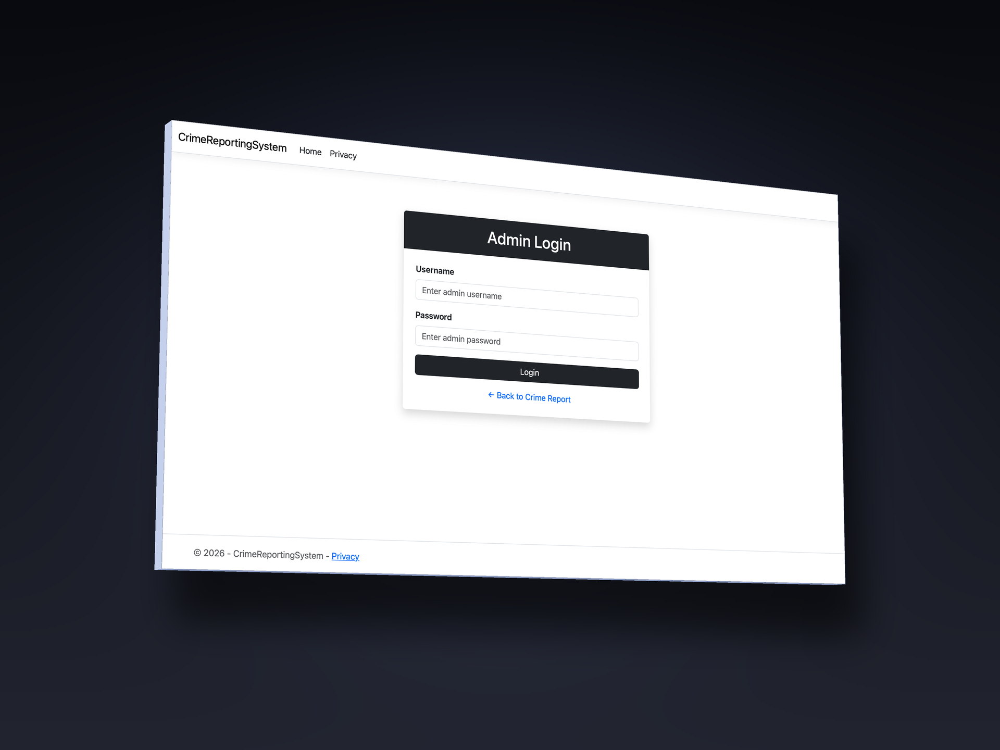
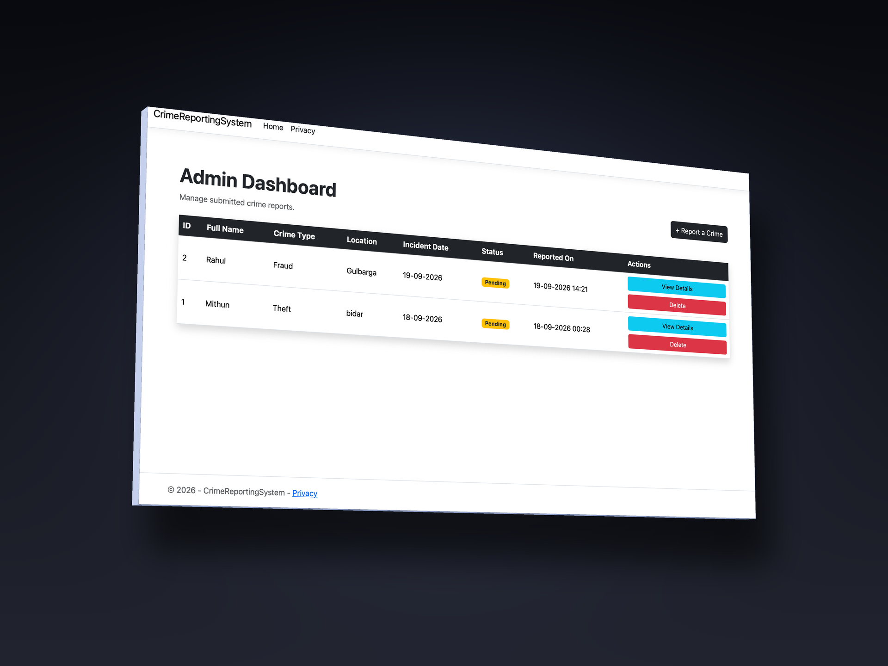
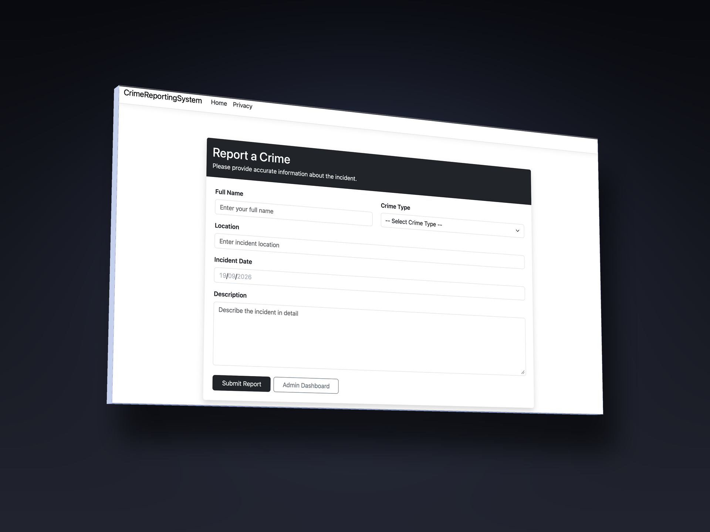
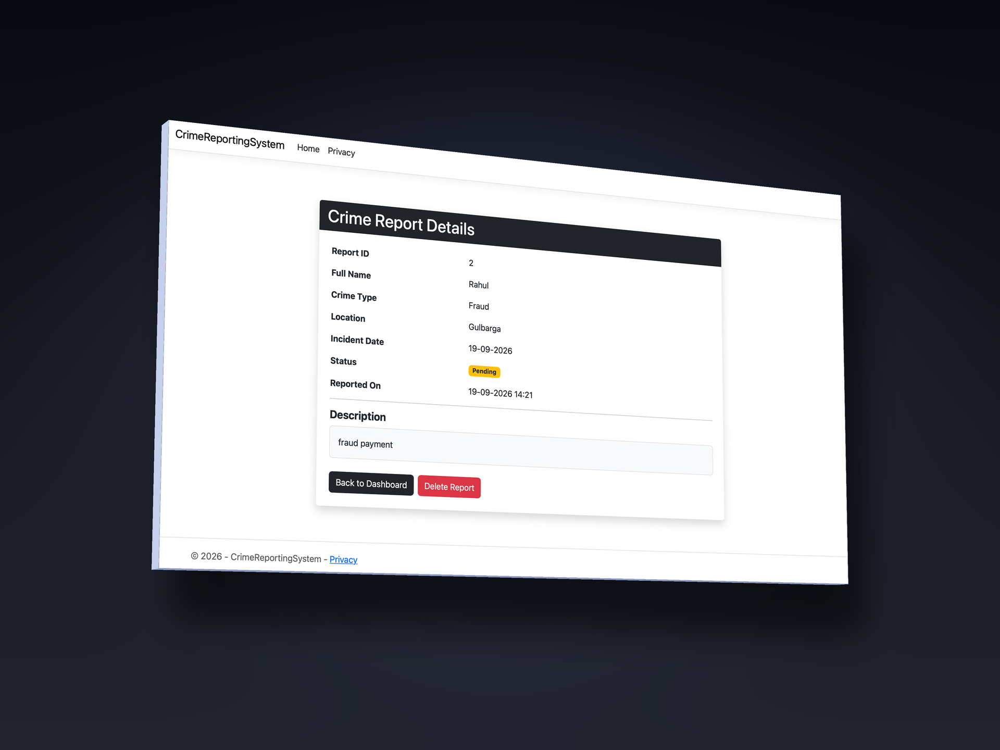

# 🚨 Crime Reporting System

A web-based **Crime Reporting System** developed using **C#, ASP.NET Core MVC, Entity Framework Core, and SQLite**.

The application provides a structured platform for submitting crime reports and allows administrators to securely access, view, and manage submitted reports through an admin dashboard.

---

## 🚀 Features

* 🔐 Admin Login
* 📊 Admin Dashboard
* 📝 Report a Crime
* 📋 View Crime Reports
* 🔍 Crime Report Details
* 🗑️ Delete Crime Reports
* 🔄 Crime Report Status Tracking
* 🗄️ SQLite Database Integration
* ⚡ ASP.NET Core MVC Architecture
* 📅 Automatic Report Creation Date and Time

---

## 🛠️ Technologies Used

| Technology                | Purpose                    |
| ------------------------- | -------------------------- |
| **C#**                    | Application development    |
| **ASP.NET Core MVC**      | Web application framework  |
| **Entity Framework Core** | Database access and ORM    |
| **SQLite**                | Database management        |
| **HTML5**                 | Page structure             |
| **CSS3**                  | Styling and user interface |
| **JavaScript**            | Client-side functionality  |
| **.NET**                  | Application runtime        |

---

## 🏗️ Architecture

The project follows the **ASP.NET Core MVC architecture** with separate components for application logic, database access, models, controllers, and views.

```text
CrimeReportingSystem
│
├── Controllers
│   └── CrimeReportsController.cs
│
├── Models
│   └── CrimeReport.cs
│
├── Data
│   └── ApplicationDbContext.cs
│
├── Views
│   └── CrimeReports
│       ├── Index.cshtml
│       ├── Admin.cshtml
│       ├── Create.cshtml
│       └── Details.cshtml
│
├── wwwroot
│   ├── css
│   ├── js
│   └── images
│
├── Migrations
│
├── appsettings.json
├── Program.cs
└── CrimeReportingSystem.csproj
```

---

# 📸 Screenshots

## 🔐 Admin Login

The Admin Login page provides authorized administrators with access to the crime report management system.



---

## 📊 Admin Dashboard

The Admin Dashboard provides administrators with a centralized interface to view and manage submitted crime reports.



---

## 📝 Report a Crime

The Report a Crime page allows users to submit crime-related information through a structured reporting form.



---

## 🔍 Crime Details

The Crime Details page displays the complete information associated with a submitted crime report.



---

# ⚙️ Getting Started

## Prerequisites

Before running the project, make sure the following software is installed:

* [.NET SDK](https://dotnet.microsoft.com/)
* Visual Studio or Visual Studio Code
* Git

The application uses SQLite for database storage.

---

## 📥 Clone the Repository

```bash
git clone https://github.com/chavanmithuun11/CrimeReportingSystem.git
```

Move into the project directory:

```bash
cd CrimeReportingSystem
```

---

## 📦 Restore Dependencies

```bash
dotnet restore
```

---

## 🔨 Build the Project

```bash
dotnet build
```

---

## ▶️ Run the Application

```bash
dotnet run
```

The terminal will display the local application URL.

Open the displayed URL in a web browser to launch the application.

---

# 🗄️ Database

The system uses **SQLite** together with **Entity Framework Core** to store crime report information.

The database is used to manage submitted reports and their associated information.

---

# 🔄 System Workflow

```text
User
  │
  ▼
Report a Crime
  │
  ▼
Crime Report Submitted
  │
  ▼
SQLite Database
  │
  ▼
Admin Login
  │
  ▼
Admin Dashboard
  │
  ├── View Reports
  │
  ├── View Crime Details
  │
  └── Delete Reports
```

---

# 📂 Repository Structure

```text
CrimeReportingSystem/
│
├── Controllers/
│   └── CrimeReportsController.cs
│
├── Models/
│   └── CrimeReport.cs
│
├── Data/
│   └── ApplicationDbContext.cs
│
├── Views/
│   └── CrimeReports/
│       ├── Index.cshtml
│       ├── Admin.cshtml
│       ├── Create.cshtml
│       └── Details.cshtml
│
├── wwwroot/
│   ├── css/
│   ├── js/
│   └── images/
│
├── Migrations/
│
├── screenshots/
│   ├── admin-login.png
│   ├── admin-dashboard.png
│   ├── report-a-crime.png
│   └── crime-details.png
│
├── appsettings.json
├── Program.cs
├── CrimeReportingSystem.csproj
└── README.md
```

---

# 👨‍💻 Developer

### Mithun Chavan

**BCA Student | Junior ASP.NET Core Developer**

Full-stack software developer focused on building web applications using **C#, ASP.NET Core, Entity Framework Core, SQL, and modern web technologies**.

---

# 🔗 Connect With Me

* 🌐 **Portfolio:** [Visit My Portfolio](https://soft-valkyrie-489a70.netlify.app/)
* 💼 **Upwork:** [View My Upwork Profile](https://www.upwork.com/freelancers/~01e0a2cb81f069867a)
* 🐙 **GitHub:** [View My GitHub Profile](https://github.com/chavanmithuun11)
* 🔗 **LinkedIn:** [Connect With Me on LinkedIn](https://www.linkedin.com/in/chavanmithuun09)
* 📷 **Instagram:** [Follow Me on Instagram](https://www.instagram.com/chavanmithuun11)

---

# 📂 Project Repository

**Crime Reporting System:**
https://github.com/chavanmithuun11/CrimeReportingSystem

---

# 📌 Project Summary

The **Crime Reporting System** is a web-based application designed to provide a simple and organized method for submitting and managing crime reports.

The system demonstrates practical implementation of:

* ASP.NET Core MVC
* C#
* Entity Framework Core
* SQLite
* CRUD Operations
* MVC Architecture
* Database Integration
* Admin Authentication
* Admin Dashboard
* Crime Report Management

The project was developed as an academic and portfolio project to demonstrate practical web application development using the **Microsoft .NET ecosystem**.

---

## 📄 License

This project is created for academic and portfolio purposes.
